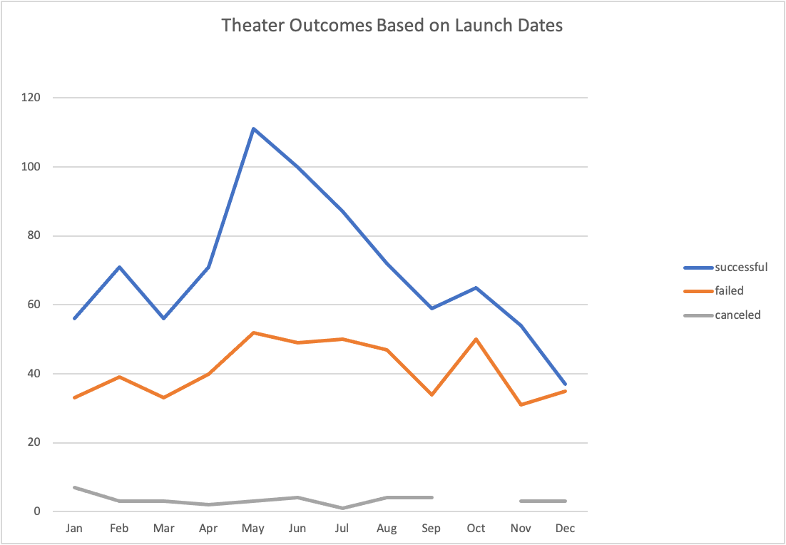
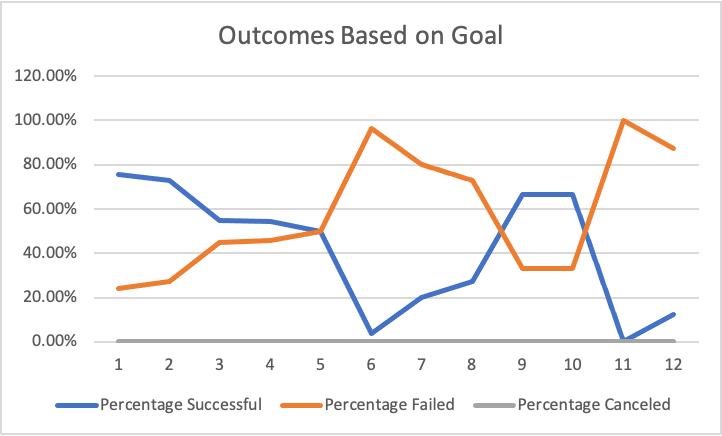

# Kickstarting with Excel

## Overview of Project
This project requires me to explore how different campaigns fared in relation to their launch dates and their funding goals. 
### Purpose
To determine if there is an optimal campaign size and campaign length that will give Louise the best probability for a successful Kickstarter campaign based on the information I was provided.
## Analysis and Challenges

### Analysis of Outcomes Based on Launch Date
Using the information that we gathered, it can be determined that the optimal time of year to run a campaign successfully is in between April and August with May and June giving Louise the best chance of success.

### Analysis of Outcomes Based on Goals
The data shows an opportunity to capture a larger campaign because there are fewer being launched. The evidence shows that campaigns under $1000 are most likely to be funded 76% and campaigns under $5000 have a 73% probability of being funded.

### Challenges and Difficulties Encountered
One challenge I encountered was narrowing down the data set to only include theater productions, there was a broad range of categories and subcategories.This was overcome through using multiple filter strategies to isolate the relevant data. 
## Results
- What are two conclusions you can draw about the Outcomes based on Launch Date?
Conclusion 1) Timing matters in being successful, the ideal time to launch a campaign is May and June.
Conclusion 2) The December has the fewest launches and the highest percentage of failures.
- What can you conclude about the Outcomes based on Goals?
The smaller the better. Larger campaigns have a higher percentage of failures. 
- What are some limitations of this dataset?
One limitation of this data set is that we only looked at Kickstarter to gather data and didn’t consider another crowdfunding site.
Different geographical regions within and outside of the country to see if there are other areas to collaborate with Tourism and Culture agencies.
- What are some other possible tables and/or graphs that we could create?
I would like to explore Launch date and size of campaign further to different sized campaigns are more or less likely to get funded at different times of year.
Under Outcomes Based on Goals- the $35,000-$39,000 and $40,000-$44,999 had a 67% success percentage, I would like to look further at those Goal ranges and explore length of campaigns. 
Is there a point where a campaign becomes white noise, determining an optimal length of time for similar sized campaign.
